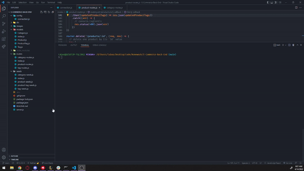

# E-Commerce Backend

  

  ***
  ## Table of Contents
  - [Description](#description)
  - [Visual Presentation](#visual-presentation)
  - [Technologies Used](#technologies-used)
  - [Installation](#installation)
  - [Usage](#usage)
  - [Contribution](#contribution)
  - [Testing](#testing)
  - [Additional Info](#additional-info)

  ***
  ## Description
  A backend program to help manage products.

  ***
  ## Technologies Used
  

  ***
  ## Visual Presentation
  

  ***
  ## Installation
  Simply download from github and run `npm i` to get the needed packages.

  ***
  ## Usage
  Connecting to your MySql backend to manage products.

  ***
  ## Contribution
  Any can contribute, simply fork the repo.

  ***
  ## Testing
  N/A

  ***
  ## Additional Info
  - Github: TabuHana(https://github.com/TabuHana)
  - Email: nate31196@outlook.com
